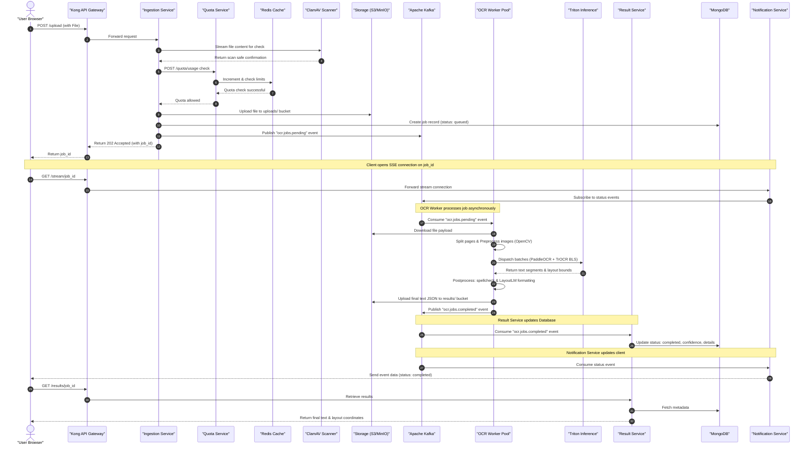

# 📐 Platform Architecture & Component Guide

This document describes the design patterns, microservices configuration, event flows, and infrastructure layout that power the Enterprise-Grade OCR Platform.

---

## 🏗️ Design Philosophy

The platform is designed around three core principles:
1. **Decoupled & Event-Driven:** Heavy CPU/GPU processing workloads (OCR Workers) are completely isolated from network-bound API services (Ingestion) via **Apache Kafka** event topics.
2. **SLA-Driven Scaling:** User quotas are verified at the gateway and ingestion layers before any files are uploaded or sent to GPU inference nodes.
3. **Unified Host Gateway:** Client applications query all services through the single public port `8080` (Kong Gateway), simplifying CORS, routing, and token propagation.

---

## 🔄 System Architecture Overview

The following diagram illustrates the network topography, microservices mesh, database links, and third-party integrations:

```mermaid
graph TD
    %% Clients
    classDef client fill:#f9f,stroke:#333,stroke-width:2px;
    classDef gateway fill:#bbf,stroke:#333,stroke-width:2px;
    classDef service fill:#fff,stroke:#333,stroke-width:1px;
    classDef queue fill:#fbb,stroke:#333,stroke-width:1px;
    classDef database fill:#bfb,stroke:#333,stroke-width:1px;
    classDef external fill:#f96,stroke:#333,stroke-width:1px;

    subgraph UserSpace [Client Layer]
        UI["Next.js Web UI"]:::client
        API["External API Clients"]:::client
    end

    subgraph EdgeGateway [Gateway Layer]
        Kong["Kong API Gateway (Port 8080)"]:::gateway
    end

    subgraph Microservices [Microservice Mesh]
        Auth["Auth Service (Port 8001)"]:::service
        Ingestion["Ingestion Service (Port 8002)"]:::service
        Quota["Quota Service (Port 8003)"]:::service
        Result["Result Service (Port 8004)"]:::service
        Notification["Notification Service (Port 8005)"]:::service
        Chat["Chat Service (Port 8006)"]:::service
        Worker["OCR Worker Pool (KEDA Scaled)"]:::service
    end

    subgraph StorageCache [Data & Cache Layer]
        Redis[("Redis Cache - Quota Counters")]:::database
        MongoDB[("MongoDB - Job Metadata")]:::database
        S3[("Amazon S3 / MinIO - Object Store")]:::database
    end

    subgraph Inference [Inference Layer]
        Triton["NVIDIA Triton Server (GPU Inference)"]:::service
    end

    subgraph Security [Security Services]
        ClamAV["ClamAV Daemon (Malware Scanner)"]:::service
    end

    subgraph IAM [Identity Providers]
        Cognito["AWS Cognito / Keycloak"]:::external
    end

    subgraph Monitoring [Observability Stack]
        Langfuse["Langfuse (LLM Tracer)"]:::external
        Jaeger["Jaeger (Distributed Tracing)"]:::external
        Grafana["Prometheus / Grafana Metrics"]:::external
    end

    %% Routing
    UI --> Kong
    API --> Kong

    %% Gateway Routing
    Kong --> Auth
    Kong --> Ingestion
    Kong --> Result
    Kong --> Chat
    Kong --> Notification

    %% Service Logic
    Auth --> Cognito
    Ingestion --> ClamAV
    Ingestion --> Quota
    Quota --> Redis
    Ingestion --> S3
    Ingestion --> MongoDB

    %% Kafka Events
    Ingestion -->|1. Publish ocr.jobs.pending| Kafka[("Apache Kafka - Event Stream")]:::queue
    Worker -->|2. Consume event| Kafka
    Worker --> S3
    Worker --> Triton
    Worker -->|3. Publish ocr.jobs.completed| Kafka
    Result -->|4. Consume event| Kafka
    Result --> MongoDB
    Notification -->|5. Listen for updates| Kafka
    Notification -->|6. Stream SSE| UI

    %% LLM RAG
    Chat --> MongoDB
    Chat --> OpenAI["OpenAI API GPT-4o"]:::external
    Chat --> Ollama["Local Ollama Llama 3.2"]:::external
    Chat --> Langfuse
```

---

## 🔄 End-to-End Data Pipeline Flow

The flowchart below traces the path of a single document upload through the platform:

---

## ⚡ Key Microservices

### Ingestion Service (8002)
Acts as the entrypoint for user files.
* Streams uploads to the ClamAV daemon for real-time antivirus scans.
* Computes page counts of PDFs and queries the Quota Service before allocating cloud storage.
* Handles uploading files to local MinIO or AWS S3 buckets and registers job metadata in MongoDB.

### Quota Service (8003)
Enforces usage boundaries across multi-tier accounts.
* Tracks limits for concurrent sessions, page count, and byte sizes.
* Leverages Redis for high-performance counter updates.
* Automatically evicts stale tier details within 60 seconds when changes are committed in the MongoDB configuration dashboard.

### OCR Worker Pool
Distributed, message-driven workers responsible for processing documents.
* Auto-scales from **0 to 10 nodes** via KEDA based on Kafka queue depth (`ocr.jobs.pending`).
* Splits multi-page documents, deskews, and binarizes pages using OpenCV.
* Invokes deep learning inference over gRPC on Triton and saves structured layout files.

### Triton Inference Server (9700)
Maintains deep learning models in memory:
* `ocr_detection`: PaddleOCR model running in an ONNX runtime.
* `ocr_recognition`: TrOCR Transformer model optimized as a TensorRT engine.
* `ocr_ensemble`: A Business Logic Script (BLS) combining detection and recognition into a single pipeline request.

### Chat Service (8006)
Provides RAG (Retrieval-Augmented Generation) chat over processed document text.
* Utilizes LangChain for context-aware prompt parsing.
* Integrates a Smart Router to dispatch tasks dynamically: OpenAI GPT-4o for paid plans or complex questions, and Ollama Llama-3.2:1b for free accounts or fallbacks.
* Publishes observability traces directly to Langfuse.

---

## 🔒 Security Architecture

Security is baked into every layer of the network and microservices:
1. **Antivirus Scanning:** No file is written to storage or parsed unless it successfully clears the ClamAV scanning stream.
2. **Network Policies:** Pod-to-pod communications are restricted. Only designated services can reach databases and caching servers. The Triton Inference server only accepts connections from the `ocr-worker` pool.
3. **Data Sovereignty:** Temporary files are strictly constrained to the user's tier retention window (e.g., 24 hours for Free Tier) and automatically purged using S3 lifecycle rules.
