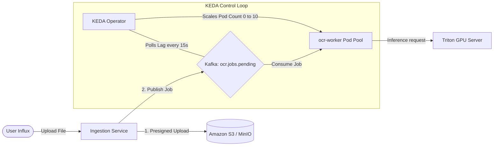
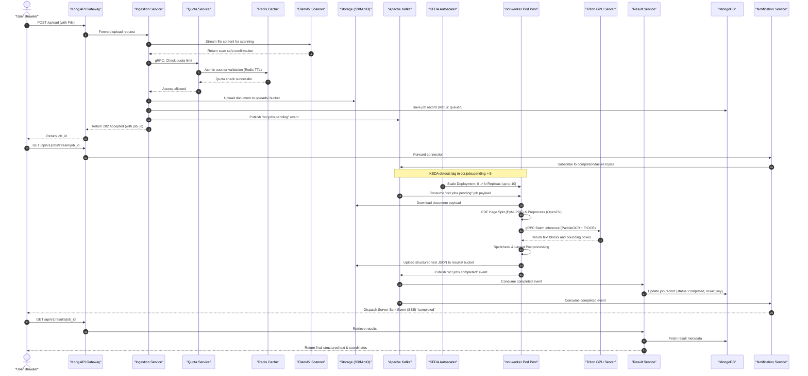

# 🐋 Docker, Kubernetes, and Helm Architecture Analysis

This document provides a detailed breakdown of how the Event-Driven OCR Platform utilizes Docker, Kubernetes, and Helm for containerization, orchestration, and dynamic event-driven autoscaling based on workload throughput. It also validates how the current codebase supports these architectures.

---

## 1. Containerization with Docker & Compose

The platform is fully containerized, separating services into lightweight, single-purpose Docker containers. 

### Local Development vs. Production Configurations
* **Local Development (`docker-compose.yml`):**
  * Spins up the entire ecosystem of 10 microservices and their backing datastores (MongoDB, Redis, Kafka, Zookeeper, MinIO, ClamAV, Ollama, Langfuse, Prometheus, Grafana, Jaeger).
  * Services share a bridge network (`ocr-platform-net`) for internal communication.
  * Triton Inference Server runs in **CPU mock mode** via `Dockerfile.cpu` for developer machines without dedicated GPUs.
  * Local volume mounts are used for persistent databases and models.
* **Production Docker:**
  * Uses optimized multi-stage builds. For example, `services/ocr-worker/Dockerfile` uses `python:3.11-slim` with precise apt packages (`poppler-utils`, `libgl1`, `libglib2.0-0`) and runs under a non-root `appuser` (UID `1001`) for compliance.

---

## 2. Orchestration with Kubernetes (K8s)

The orchestration layer is configured in `infrastructure/k8s/` and organizes resources inside a dedicated namespace `ocr-platform`.

### Pods & Services Structure
1. **Microservices (Pods):**
   Each microservice (e.g., `auth-service`, `ingestion-service`, `quota-service`) is defined as a `Deployment` with replication limits, standard resource constraints (requests/limits for CPU/Memory), and health checks:
   * **Liveness Probes:** Check HTTP `/health` or `/_stcore/health` to restart dead containers.
   * **Readiness Probes:** Prevent traffic from routing to starting pods until they successfully ping databases or downstream dependencies.
2. **Internal Networking (Services):**
   Services are defined with type `ClusterIP` (ports `8000` / `8005` for HTTP, and `50051`-`50055` for inter-service gRPC).
3. **Public Traffic Routing (Ingress):**
   Public ingress uses a **Kong Ingress Controller** (`infrastructure/k8s/ingress.yaml`). It intercepts public DNS domains (`ocrplatform.com`, `api.ocrplatform.com`, `admin.ocrplatform.com`) and routes traffic to `web-app`, `admin-service`, or specific path-prefixed backends (e.g., `/ingestion-service`, `/quota-service`).

---

## 3. Dynamic Deployment Scaling (KEDA)

Dynamic deployment based on user throughput is managed using **KEDA (Kubernetes Event-driven Autoscaling)** rather than the standard Horizontal Pod Autoscaler (HPA) which scales purely on CPU/Memory.

### Kafka-Driven Scaling Mechanism
* The pipeline separates file ingestion from OCR processing using Apache Kafka topics.
* Under `infrastructure/k8s/keda-scaledobject.yaml`, KEDA monitors the consumer group `ocr-workers` on the `ocr.jobs.pending` topic.
* **Scale-To-Zero:** When there are no jobs pending in the Kafka topic, KEDA scales the `ocr-worker` deployment down to **0 replicas** to save GPU costs.
* **Scale-Up:** When the lag exceeds **5 messages per partition** (`lagThreshold: "5"`), KEDA dynamically provisions additional `ocr-worker` pods up to a maximum of **10 replicas**.



---

## 4. Packaging with Helm

While the platform currently uses raw Kubernetes manifests in `infrastructure/k8s/` for environment deployments, Helm is utilized in the production roadmap to bundle these components into a single package.

### How K8s Manifests Map to a Helm Chart
By organizing the manifests as a Helm chart, we template env-specific attributes using `values.yaml`:

```
ocr-platform-chart/
├── Chart.yaml                  # Metadata (API version, appVersion, name)
├── values.yaml                 # Configuration variables (replicas, registry URLs, DB connection strings)
├── templates/
│   ├── _helpers.tpl            # Reusable template snippets and label generators
│   ├── configmap.yaml          # Templated configuration values
│   ├── secrets.yaml            # Secret placeholders pointing to Vault/Cognito
│   ├── deployments.yaml        # Standard deployments mapping image repository to {{ .Values.image.repository }}
│   ├── ingress.yaml            # Route definitions templating host names
│   ├── keda-scaledobject.yaml  # KEDA autoscaler mapping queue details
│   └── network-policies.yaml   # Network security mappings
```

This allows single-command deployments:
```bash
helm install ocr-platform ./ocr-platform-chart -f values.prod.yaml
```

---

## 5. End-to-End Real-Time Use Case Flow

The flowchart below traces a document's journey from client ingestion to worker processing, dynamic scaling, database updates, and SSE notification streaming.



---

## 6. Codebase Validation

Here is a verification of how the current code supports this architecture:

### 1. Ingestion & Quota Verification
* **Path:** `services/ingestion-service/routers/upload.py` ([upload.py](file:///f:/AI/imgpdftotextocr/services/ingestion-service/routers/upload.py#L41-L188))
* **Support status:** **Supported**.
* **Validation:** Before any upload begins, the service performs file validation, calls [check_quota_for_user](file:///f:/AI/imgpdftotextocr/services/ingestion-service/routers/upload.py#L96), streams the file to [scan_file](file:///f:/AI/imgpdftotextocr/services/ingestion-service/routers/upload.py#L117) (ClamAV), uploads the file to object storage via [StorageClient.upload](file:///f:/AI/imgpdftotextocr/services/ingestion-service/routers/upload.py#L133), records it in MongoDB, and submits it to Kafka:
  ```python
  await KafkaProducerClient.send(
      topic=settings.KAFKA_TOPIC_OCR_PENDING,
      key=user_id,
      value=event,
  )
  ```

### 2. High-Performance Quota Counting & Redis Caching
* **Path:** `services/quota-service/quota_engine.py` ([quota_engine.py](file:///f:/AI/imgpdftotextocr/services/quota-service/quota_engine.py#L83))
* **Support status:** **Supported**.
* **Validation:** Implements Redis pipelines to atomically check (`check`) and update (`increment`) counters for multiple periods (`session`, `day`, `week`, `month`) in a single round-trip:
  ```python
  async with _redis.pipeline(transaction=True) as pipe:
      for period, key in keys.items():
          pipe.incrby(key, pages)
          pipe.expire(key, cls._ttl_for(period))
      await pipe.execute()
  ```

### 3. Asynchronous OCR Worker
* **Path:** `services/ocr-worker/worker.py` ([worker.py](file:///f:/AI/imgpdftotextocr/services/ocr-worker/worker.py#L38))
* **Support status:** **Supported**.
* **Validation:** Consumes messages from Kafka in a loop, downloads the file from MinIO/S3, preprocesses the pages, invokes Triton inference, uploads results, publishes to Kafka, and increments the quota service:
  ```python
  await increment_quota(user_id=user_id, session_id=event["session_id"], tier=event["tier"], pages=len(page_results))
  ```

### 4. Dynamic Scale-to-Zero KEDA Autoscaler
* **Path:** `infrastructure/k8s/keda-scaledobject.yaml` ([keda-scaledobject.yaml](file:///f:/AI/imgpdftotextocr/infrastructure/k8s/keda-scaledobject.yaml))
* **Support status:** **Supported**.
* **Validation:** Correctly references the target deployment `ocr-worker`, starts with `minReplicaCount: 0` (scale-to-zero when Kafka topic has no messages), handles up to `maxReplicaCount: 10`, and triggers scaling when consumer group lag for `ocr.jobs.pending` exceeds `5` messages per partition.

### 5. Network Isolation
* **Path:** `infrastructure/k8s/network-policies.yaml` ([network-policies.yaml](file:///f:/AI/imgpdftotextocr/infrastructure/k8s/network-policies.yaml))
* **Support status:** **Supported**.
* **Validation:** Restricts communication across components. For example, `triton-ingress` whitelists incoming requests *only* from pods matching `app: ocr-worker` on ports `8000` / `8001`.
